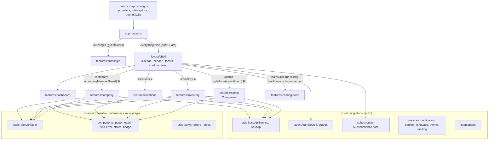
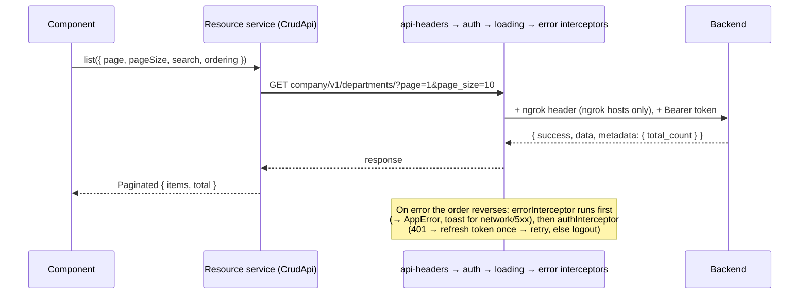
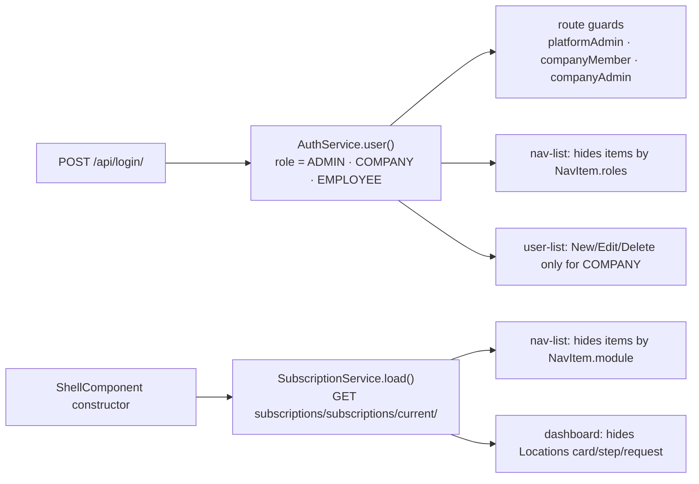
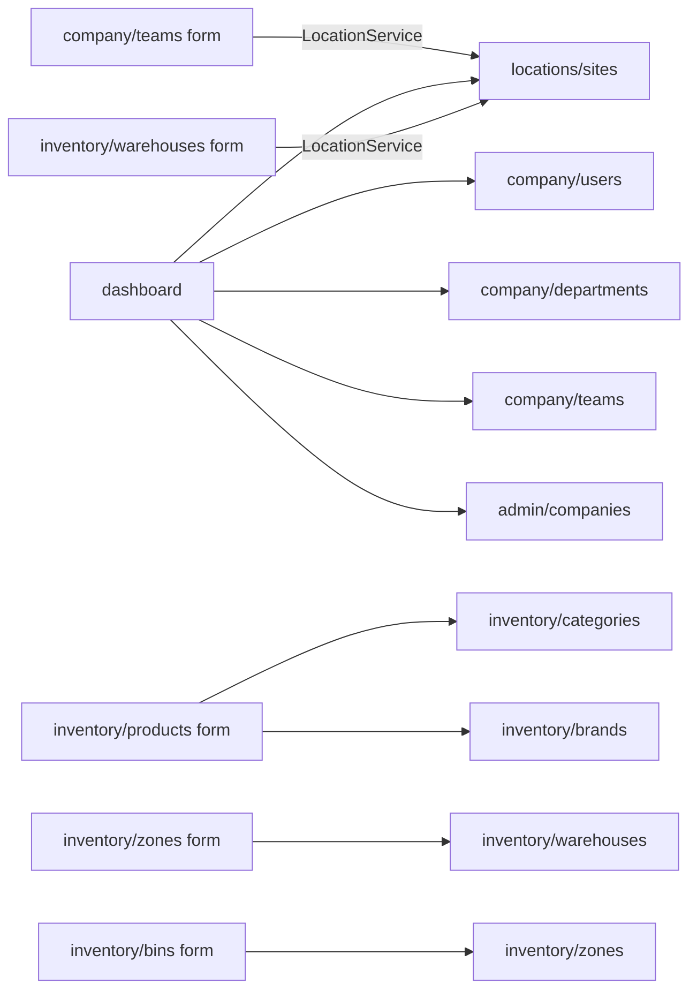

# Code map

A reference for reading and reviewing the frontend: what each part does, how the parts connect, and where the
non-obvious logic lives. Rules and the roadmap are in [ARCHITECTURE.md](ARCHITECTURE.md).

**Legend** — use these markers to decide where to look closely during a review:

| Marker | Meaning |
|---|---|
| 🧠 | Non-obvious logic: read the code and its comment before changing it |
| ⚠️ | Works around a backend bug; remove when the backend is fixed (item in `docs/BACKEND_REQUESTS.md`) |
| 🆕 | A project-wide pattern or concept introduced here; other code depends on it |
| 🔒 | Access control (who can see or do what) |

Paths are relative to `src/app/`.

---

## 1. The big picture

## 2. One HTTP request, end to end 🧠

- `core/api/crud-api.ts` 🆕 — `list / all / listAll / dropdown / retrieve / create / update (PATCH) / remove`.
  Unwraps the `{ success, data, metadata }` envelope. `listAll` 🧠 pages through 100 at a time (the backend max).
- `core/interceptors/auth.interceptor.ts` 🧠 — the refresh is shared between parallel 401s
  (`AuthService.refreshAccessToken` keeps one in-flight request); a request is retried only once (`RETRIED` token).
- `core/interceptors/error.interceptor.ts` — every error becomes an `AppError` (`core/errors/app-error.ts`).
  Screens never see `HttpErrorResponse`.

## 3. Who sees what 🔒 🧠

| Role | Meaning | Sees |
|---|---|---|
| `ADMIN` | Platform admin: a user with **no company** | Dashboard (company counts) and Companies |
| `COMPANY` | Company admin | Every company section their subscription allows; manages users |
| `EMPLOYEE` | Any other company user | Same sections, read-only Users list, no setup checklist |

Things to know:
- The backend only checks permissions in a few places (BACKEND_REQUESTS Priority 1). Hiding in the UI is
  convenience, not security.
- `SubscriptionService.allows()` 🧠 returns **false while loading** (no flicker) and **true after an error**
  (fail open: the backend still answers 403). A 404 means "no subscription" → nothing allowed.
- `layout/nav/nav-list.component.ts` 🧠 expands the active group by looking at **all** `NAV_ITEMS`, because a
  module-gated group only appears after the subscription has loaded.

## 4. core/

| File | Purpose | Notes |
|---|---|---|
| `api/api.config.ts` | `API_BASE_URL` from `src/environments` | Prod points at the backend's ngrok URL |
| `api/base-api.service.ts` | Typed `get/post/put/patch/delete` with the base URL | |
| `api/crud-api.ts` | Standard calls for one resource | 🆕 every resource service extends it |
| `auth/auth.service.ts` | Signed-in user, login, logout, token refresh | 🧠 role restored from the JWT on reload |
| `auth/token-storage.service.ts` | Tokens in localStorage | |
| `auth/auth.guard.ts` | `authGuard`, `guestGuard`, `platformAdminGuard`, `companyMemberGuard`, `companyAdminGuard` | 🔒 |
| `errors/app-error.ts` | `AppError` + `toAppError()` | The only error shape in the app |
| `errors/global-error-handler.ts` | Toast for uncaught non-HTTP errors | |
| `interceptors/api-headers.interceptor.ts` | `ngrok-skip-browser-warning` for ngrok hosts | ⚠️ ngrok free tier, not a backend bug |
| `interceptors/auth.interceptor.ts` | Bearer token, refresh on 401 | 🧠 see §2 |
| `interceptors/loading.interceptor.ts` | Counts requests for the loading bar | |
| `interceptors/error.interceptor.ts` | → `AppError`, toast for network/5xx | |
| `models/api-response.model.ts` | Envelope types, `Paginated<T>` | |
| `services/confirm.service.ts` | `confirmDelete(name, remove, onDeleted)` | 🆕 used by every list that deletes |
| `services/notification.service.ts` | Toasts | |
| `services/language.service.ts` | en/ar, sets `<html lang dir>` | |
| `services/theme.service.ts` | Light/dark via `.dark` on `<html>` | 🧠 `index.html` applies it before Angular starts |
| `services/loading.service.ts` | Requests in flight | |
| `subscription/subscription.service.ts` | Enabled subscription modules | 🧠 🔒 see §3 |
| `theme/tanzim-preset.ts` | PrimeNG Aura preset (indigo) | 🧠 CSS layer order in `src/layer-order.css` |

## 5. layout/ and shared/

| File | Purpose | Notes |
|---|---|---|
| `layout/shell/` | Frame for signed-in pages; loads the subscription | Hosts the toast and the confirm dialog once |
| `layout/header/` | Breadcrumb (route `data.titleKey` + nav group), language/theme toggles, user menu | |
| `layout/sidebar/` + `brand.component` | Desktop sidebar | Mobile uses a PrimeNG drawer in the shell |
| `layout/nav/nav-items.ts` | The menu: label, icon, link, `module`, `roles`, children | 🔒 the single place to add a menu entry |
| `layout/nav/nav-list.component` | Renders the menu, filters it, expands the active group | 🧠 §3 |
| `shared/table/server-table.ts` | State for server-paged tables | 🆕 🧠 cancels stale requests; steps back a page after deleting the last row |
| `shared/utils/server-errors.ts` | `applyServerErrors`, `handleSaveError`, `errorTitleKey` | 🆕 🧠 flattens nested backend errors to dotted keys (`user.email`) |
| `shared/utils/omit-pristine.ts` | Drops untouched fields from an edit body | 🆕 ⚠️ for read endpoints that don't return every field (BACKEND_REQUESTS 15e) |
| `shared/components/field-error` | Message under an input | Not OnPush on purpose (reacts to `touched`) |
| `shared/components/page-header` | Title, back link, action buttons | |
| `shared/components/confirm-dialog` | The one PrimeNG confirm dialog | Opened only through `ConfirmService` |
| `shared/components/empty-state`, `error-state`, `loading-state`, `status-badge`, `loading-bar` | Visual states | |
| `shared/pipes/localized-name.pipe.ts` | Arabic name in Arabic, else English | |
| `shared/pipes/user-name.pipe.ts` | Full name → first + last → email | |

## 6. features/

Every resource below has a `*.service.ts`, a list and a form unless noted. Lists use `ServerTable` unless
marked "client list".

### auth, dashboard, coming-soon

| Path | Notes |
|---|---|
| `auth/login/` | Split-screen login, language/theme toggles |
| `dashboard/` | 🧠 🔒 three versions: platform counts (ADMIN), stats + setup + quick actions (COMPANY), stats only (EMPLOYEE). Counts locations only once the `location` module is known to be on (`effect`). Reads services from company, locations and admin |
| `coming-soon/` | 🆕 one placeholder page for every unbuilt section, title and icon from route data |

### admin — `/admin` (platform admins only) 🔒

| Resource | Endpoint | Notes |
|---|---|---|
| `companies/` (`TenantCompanyService`) | `company/v1/admin/company/` | Client list (not paginated). **No delete button**: the backend hard-deletes with cascade. ⚠️ phone left out when empty. Email required on create (the backend emails the admin's password) |

### company — `/company`

| Resource | Endpoint | Notes |
|---|---|---|
| `users/` (`CompanyUserService`) | `company/v1/company-user/` | Client list. 🔒 New/Edit/Delete for COMPANY only (+ `companyAdminGuard`). ⚠️ edit sends only role/department/team/flags (nested user update fails). 🧠 `USER_FIELD_MAP` maps `user.email` errors to flat controls |
| `departments/` | `company/v1/departments/` | Parent picker excludes itself |
| `teams/` | `company/v1/teams/` | Uses `LocationService.dropdown()` for the location picker |
| `roles/` | `company/v1/roles/` | |
| `permission-groups/` | `company/v1/permission-groups/` | |
| `permissions/` | `company/v1/permissions/` | ⚠️ no search box (backend search returns 500) |

### locations — `/locations` (module `location`)

| Resource | Endpoint | Notes |
|---|---|---|
| `sites/` (`LocationService`) | `company/v1/location/` | 🧠 cascading pickers Country → Region → City → District filtered in the browser (no parent filter in the API). ⚠️ PATCH always sends the full body |
| `countries/` | `company/v1/country/` | ISO and phone code validated client-side |
| `regions/` | `company/v1/region/` | |
| `cities/` | `company/v1/city/` | ⚠️ time zone list starts with UTC/GMT (older backends accept only those) |
| `districts/` | `company/v1/district/` | |

### inventory — `/inventory` (module `inventory`)

| Resource | Endpoint | Notes |
|---|---|---|
| `products/` | `inventory/v1/product/` | Enum selects (type, valuation); shelf life only with an expiry date |
| `categories/` | `inventory/v1/category/` | 🧠 parent picker shows the full path and excludes itself and its descendants. ⚠️ edit sends name/parent only when changed (15a) |
| `brands/` | `inventory/v1/brand/` | Smallest resource: copy it for new ones |
| `warehouses/` | `inventory/v1/warehouse/` | ⚠️ code shown from the dropdown (list + edit); contact/address not returned → `omitPristine`; no manager field (backend 500) |
| `zones/` | `inventory/v1/zone/` | Warehouse picker "Name (CODE)". ⚠️ code/description not returned → `omitPristine` |
| `bins/` | `inventory/v1/bin/` | 🧠 zone picker from the full zone list, labelled "Warehouse › Zone". ⚠️ code/barcode/capacity/type not returned → `omitPristine` |
| `suppliers/` | `inventory/v1/supplier/` | Reliability is 0–1; empty lead time/reliability → 0. ⚠️ contact/address/terms not returned → `omitPristine`. Supplier products not built (needs variants) |

## 7. Cross-feature links

Only services and models cross feature boundaries; components never do.

## 8. Review hot spots

The places most likely to hide a bug, in the order to check them:

1. 🧠 `core/interceptors/auth.interceptor.ts` + `AuthService.refreshAccessToken` — token refresh and logout.
2. 🧠 🔒 `core/subscription/subscription.service.ts`, `layout/nav/nav-list.component.ts` — what the menu shows.
3. 🧠 `shared/table/server-table.ts` — every list depends on it.
4. 🧠 `shared/utils/server-errors.ts` — every form depends on it.
5. 🧠 `features/locations/sites/site-form.component.ts` — cascading pickers that must not clear on load.
6. 🧠 ⚠️ `features/inventory/categories/category-form.component.ts` — tree rules and the duplicate workaround.
7. ⚠️ `shared/utils/omit-pristine.ts` and its four users (warehouse, zone, bin, supplier forms) — an edit must never
   send an untouched field the API didn't return.
8. ⚠️ Every other workaround marked above: re-check when the backend fixes the matching item.

## 9. Keeping this map up to date

- Adding a resource: add one row to its area table in §6 (endpoint + anything unusual).
- Adding a feature area: add a §6 sub-section, a node in §1, and any cross-links in §7.
- Adding something to `core/` or `shared/`: add a row in §4 or §5; mark it 🆕 if other code will build on it.
- Adding a backend workaround: mark it ⚠️ here and add the item to `docs/BACKEND_REQUESTS.md`; remove both
  when the backend is fixed.
- Keep notes to one line. If it needs a paragraph, the explanation belongs in a code comment or a spec in
  `docs/superpowers/specs/`, and the map links to it.
