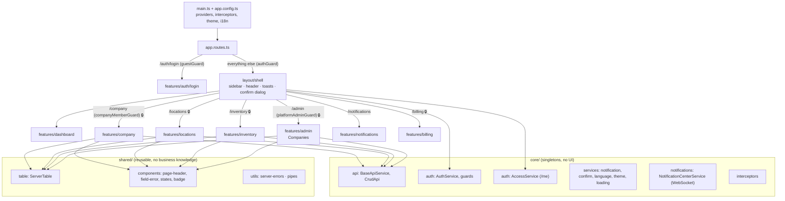
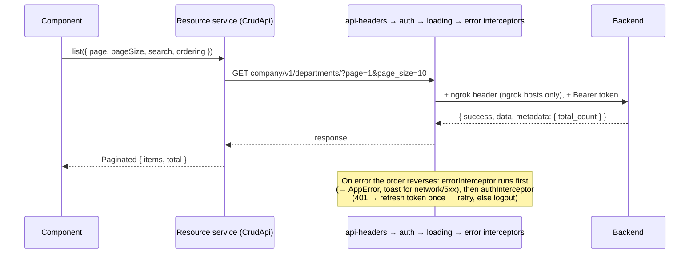
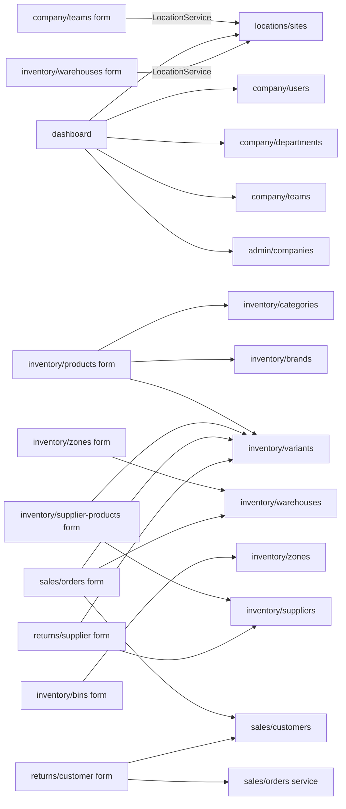

# Code map

A reference for reading and reviewing the frontend: what each part does, how the parts connect, and where the
non-obvious logic lives. Rules and the roadmap are in [ARCHITECTURE.md](ARCHITECTURE.md).

**Legend** — use these markers to decide where to look closely during a review:

| Marker | Meaning |
|---|---|
| 🧠 | Non-obvious logic: read the code and its comment before changing it |
| ⚠️ | Works around a backend bug; remove when the backend is fixed (item in `docs/BACKEND_REQUESTS.md`) |
| 🆕 | A project-wide pattern or concept introduced here; other code depends on it |
| 🔒 | Access control (who can see or do what) |

Paths are relative to `src/app/`.

---

## 1. The big picture



## 2. One HTTP request, end to end 🧠



- `core/api/crud-api.ts` 🆕 — `list / all / listAll / dropdown / retrieve / create / update (PATCH) / remove`.
  Unwraps the `{ success, data, metadata }` envelope. `listAll` 🧠 pages through 100 at a time (the backend max).
- `core/interceptors/auth.interceptor.ts` 🧠 — the refresh is shared between parallel 401s
  (`AuthService.refreshAccessToken` keeps one in-flight request); a request is retried only once (`RETRIED` token).
- `core/interceptors/error.interceptor.ts` — every error becomes an `AppError` (`core/errors/app-error.ts`).
  Screens never see `HttpErrorResponse`.

## 3. Who sees what 🔒 🧠

```mermaid
flowchart LR
    login["POST /api/login/"] --> authsvc["AuthService.user()<br/>role = ADMIN · COMPANY · EMPLOYEE"]
    me["GET /api/company/v1/me/"] --> access["AccessService<br/>can(codename) · hasModule(code) · isStaff()"]
    shellinit["ShellComponent / guards"] -->|load()| access
    access --> guards["guards: platformAdmin · companyMember · permission (route data.permission)"]
    access --> nav["nav-list: hides items by permission, module, staffOnly; drops empty groups"]
    access --> lists["company lists: New / edit / delete by add_ / change_ / delete_"]
    access --> dash["dashboard: cards, setup steps, quick actions"]
    authsvc --> guards
```

| Who | How it's known | Sees |
|---|---|---|
| Platform staff | `/me.is_staff` (token `is_staff` until /me answers) | Dashboard (company counts) and Companies |
| User without a company, not staff | login `role: ADMIN` | Dashboard welcome only |
| Company user | login `role: COMPANY`/`EMPLOYEE` | Sections their subscription has (`/me.modules`); company screens and buttons by `/me.permissions` (`has_full_access` = everything) |

Things to know:
- Only the six company resources are permission-gated by the backend (`view_/add_/change_/delete_` +
  `companyuser`, `department`, `team`, `role`, `permissiongroup`, `permission`). Locations and inventory are gated
  by subscription module only. `?dropdown=true` needs no permission, so pickers always work.
- `AccessService.can()` / `hasModule()` 🧠 return **false while /me loads** (no flicker) and **true if /me fails**
  (fail open: the backend still answers 403).
- `AccessService` 🧠 resets itself when the signed-in user changes (an `effect` on `AuthService.user()`), so the next
  user never inherits the previous user's permissions.
- Guards call `access.load()` themselves (child routes are checked before the shell exists); `load()` shares one
  request.
- `layout/nav/nav-list.component.ts` 🧠 expands the active group by looking at **all** `NAV_ITEMS`, because a gated
  group only appears after /me has loaded.

## 4. core/

| File | Purpose | Notes |
|---|---|---|
| `api/api.config.ts` | `API_BASE_URL` from `src/environments` | Prod points at the backend's ngrok URL |
| `api/base-api.service.ts` | Typed `get/post/put/patch/delete` with the base URL; `getBlob` / `postBlob` for file downloads | |
| `api/crud-api.ts` | Standard calls for one resource; `ListQuery.filters` and `all(filters)` for exact-match filters | 🆕 every resource service extends it |
| `auth/auth.service.ts` | Signed-in user, login, logout, token refresh | 🧠 role restored from the JWT on reload |
| `auth/token-storage.service.ts` | Tokens in localStorage | |
| `auth/access.service.ts` | Permissions, modules and staff flag from GET /me | 🆕 🧠 🔒 see §3 |
| `auth/auth.guard.ts` | `authGuard`, `guestGuard`, `platformAdminGuard`, `companyMemberGuard`, `permissionGuard` | 🔒 `permissionGuard` reads `route.data.permission` |
| `errors/app-error.ts` | `AppError` + `toAppError()` | The only error shape in the app. ⚠️ unwraps "['…']" workflow messages (BACKEND_REQUESTS 11) |
| `errors/global-error-handler.ts` | Toast for uncaught non-HTTP errors | |
| `interceptors/api-headers.interceptor.ts` | `ngrok-skip-browser-warning` for ngrok hosts | ⚠️ ngrok free tier, not a backend bug |
| `interceptors/auth.interceptor.ts` | Bearer token, refresh on 401 | 🧠 see §2 |
| `interceptors/loading.interceptor.ts` | Counts requests for the loading bar | |
| `interceptors/error.interceptor.ts` | → `AppError`, toast for network/5xx | |
| `models/api-response.model.ts` | Envelope types, `Paginated<T>` | |
| `notifications/notification-center.service.ts` | Notifications list, unread count, live WebSocket | 🆕 🧠 reconnects with backoff, stops on sign-out; ⚠️ socket field names differ (`toAppNotification`) |
| `services/confirm.service.ts` | `confirmDelete(name, remove, onDeleted)`; `confirmAction()` / `runAction()` for workflow buttons | 🆕 used by every list that deletes and every confirm/ship/issue/cancel action |
| `services/notification.service.ts` | Toasts | |
| `services/language.service.ts` | en/ar, sets `<html lang dir>` | |
| `services/theme.service.ts` | Light/dark via `.dark` on `<html>` | 🧠 `index.html` applies it before Angular starts |
| `services/loading.service.ts` | Requests in flight | |
| `theme/tanzim-preset.ts` | PrimeNG Aura preset (indigo) | 🧠 CSS layer order in `src/layer-order.css` |

## 5. layout/ and shared/

| File | Purpose | Notes |
|---|---|---|
| `layout/shell/` | Frame for signed-in pages; starts loading /me | Hosts the toast and the confirm dialog once |
| `layout/header/` | Breadcrumb (route `data.titleKey` + nav group), notifications bell, language/theme toggles, user menu | Bell: unread badge + popover with the latest 6 |
| `layout/sidebar/` + `brand.component` | Desktop sidebar | Mobile uses a PrimeNG drawer in the shell |
| `layout/nav/nav-items.ts` | The menu: label, icon, link, `module`, `roles`, children | 🔒 the single place to add a menu entry |
| `layout/nav/nav-list.component` | Renders the menu, filters it, expands the active group | 🧠 §3 |
| `shared/table/server-table.ts` | State for server-paged tables | 🆕 🧠 cancels stale requests; steps back a page after deleting the last row |
| `shared/utils/server-errors.ts` | `applyServerErrors`, `handleSaveError`, `errorTitleKey` | 🆕 🧠 flattens nested backend errors to dotted keys (`user.email`) |
| `shared/utils/save-file.ts` | Saves a downloaded Blob under a file name | Used by the Excel export |
| `shared/utils/omit-pristine.ts` | Drops untouched fields from an edit body | 🆕 ⚠️ for read endpoints that don't return every field (BACKEND_REQUESTS 15e) |
| `shared/components/field-error` | Message under an input (required, email, length, pattern, `greaterThan`, `max`, server) | Not OnPush on purpose (reacts to `touched`) |
| `shared/components/page-header` | Title, back link, action buttons | |
| `shared/components/notification-item` | One notification row (bell + page) | Icon/colour by type, unread dot |
| `shared/pipes/time-ago.pipe.ts` | "3 hours ago" in the current language | `Intl.RelativeTimeFormat`; not live |
| `shared/components/confirm-dialog` | The one PrimeNG confirm dialog | Opened only through `ConfirmService` |
| `shared/components/reason-dialog` | Optional-reason dialog before cancel / failed steps | Collects the text; the parent runs the action |
| `shared/components/empty-state`, `error-state`, `loading-state`, `status-badge`, `loading-bar` | Visual states | |
| `shared/pipes/localized-name.pipe.ts` | Arabic name in Arabic, else English | |
| `shared/pipes/user-name.pipe.ts` | Full name → first + last → email | |

## 6. features/

Every resource below has a `*.service.ts`, a list and a form unless noted. Lists use `ServerTable` unless
marked "client list".

### auth, dashboard, notifications, billing

| Path | Notes |
|---|---|
| `auth/login/` | Split-screen login, language/theme toggles |
| `dashboard/` | 🧠 🔒 platform counts for staff; for company users every card, setup step and quick action is gated by a permission or module (`Gate`). Counts are requested after /me answers, only for the visible cards. Reads services from company, locations and admin |
| `notifications/` | `/notifications` for every signed-in user: All/Unread, mark all read (one request each) |
| `billing/` | `/billing` (company admins in the menu): subscription card + read-only invoices with a details dialog. `BillingService` reads `subscriptions/current/` and `subscriptions/invoices/` |

### admin — `/admin` (platform admins only) 🔒

| Resource | Endpoint | Notes |
|---|---|---|
| `companies/` (`TenantCompanyService`) | `company/v1/admin/company/` | Server list with search. No delete button: DELETE only deactivates, which the form's Active switch does. Email required on create (the backend emails the admin's password). Logo upload not built yet |

### company — `/company`

| Resource | Endpoint | Notes |
|---|---|---|
| `users/` (`CompanyUserService`) | `company/v1/company-user/` | Client list (not paginated). 🔒 New/Edit/Delete by `*_companyuser` permissions (+ `permissionGuard` on the form routes). Edit sends the nested `user` without a password. `userOptions()` uses the dropdown, so pickers work without `view_companyuser`. 🧠 `USER_FIELD_MAP` maps `user.email` errors to flat controls |
| `departments/` | `company/v1/departments/` | Parent picker excludes itself. 🔒 every company list shows New/edit/delete by permission |
| `teams/` | `company/v1/teams/` | Uses `LocationService.dropdown()` for the location picker |
| `roles/` | `company/v1/roles/` | |
| `permission-groups/` | `company/v1/permission-groups/` | |
| `permissions/` | `company/v1/permissions/` | Search by name and codename |

### locations — `/locations` (module `location`)

| Resource | Endpoint | Notes |
|---|---|---|
| `sites/` (`LocationService`) | `company/v1/location/` | 🧠 cascading pickers Country → Region → City → District filtered in the browser (no parent filter in the API). List shows the backend's `full_address` |
| `countries/` | `company/v1/country/` | ISO and phone code validated client-side |
| `regions/` | `company/v1/region/` | |
| `cities/` | `company/v1/city/` | Time zone: UTC + the browser's IANA list |
| `districts/` | `company/v1/district/` | |

### inventory — `/inventory` (module `inventory`)

| Resource | Endpoint | Notes |
|---|---|---|
| `products/` | `inventory/v1/product/` | Enum selects (type, valuation); shelf life only with an expiry date. Each row links to its variants |
| `variants/` | `inventory/v1/product-variant/` | 🧠 `?product=` filter from the URL (chip + "Show all", reloads on change). 🧠 attributes edited as name/value rows (`FormArray`), sent as an object. `dimensions`/`image` never sent. ⚠️ `weight_uom` not returned → `omitPristine`. `variant-options.ts` (`toItemOption`, `trimZeros`) feeds the item pickers of the sales order and return forms |
| `categories/` | `inventory/v1/category/` | 🧠 parent picker shows the full path and excludes itself and its descendants. ⚠️ edit sends name/parent only when changed (15a) |
| `brands/` | `inventory/v1/brand/` | Smallest resource: copy it for new ones |
| `warehouses/` | `inventory/v1/warehouse/` | ⚠️ code shown from the dropdown (list + edit); contact/address not returned → `omitPristine`; no manager field (backend 500) |
| `zones/` | `inventory/v1/zone/` | Warehouse picker "Name (CODE)". ⚠️ code/description not returned → `omitPristine` |
| `bins/` | `inventory/v1/bin/` | 🧠 zone picker from the full zone list, labelled "Warehouse › Zone". ⚠️ code/barcode/capacity/type not returned → `omitPristine` |
| `suppliers/` | `inventory/v1/supplier/` | Reliability is 0–1; empty lead time/reliability → 0. ⚠️ contact/address/terms not returned → `omitPristine` |
| `supplier-invoices/` | `inventory/v1/supplier-invoice/` | Service only (`?dropdown=true` references for payment allocations and debit notes); screens wait for BACKEND_REQUESTS 2 |
| `supplier-products/` | `inventory/v1/supplier-product/` | The supplier price list. ⚠️ read returns only supplier, variant, preferred → list shows those; edit uses `omitPristine` for everything else |

### sales — `/sales` (no module needed)

Sales endpoints (`/api/sales/…`) return flat ids plus `*_name` fields, a shorter list shape than retrieve
(services add `detail(id)`), and only paginate when `page` is sent.

| Resource | Endpoint | Notes |
|---|---|---|
| `customers/` | `sales/customers/` | Type filter. `credit_used` never sent; edit shows credit used / available / open orders. Addresses via `address-fields/` |
| `orders/` (`SalesOrderService`) | `sales/sales-orders/` | List with status filter (delete on drafts only). 🧠 form: lines in a `FormArray`, one item picker over every active variant (sets product + variant + default price), totals previewed with the backend formula (`lineTotal`/`lineTax`), saving replaces all lines. ⚠️ only drafts open in the form (BACKEND_REQUESTS 12). Detail page: lines, totals, its deliveries and invoices, workflow (confirm, ship dialog, mark delivered, create invoice, cancel with reason, duplicate) via `ConfirmService.confirmAction`; 🧠 follows the `:id` param because duplicate navigates to the copy |
| `deliveries/` | `sales/delivery-notes/` | Created only from an order (Ship dialog on the order page, which issues stock). List + detail; workflow confirm → hand to carrier → delivered / failed (pick-ups skip the carrier); draft details via PATCH, then re-read (the write shape has no names) |
| `invoices/` | `sales/sales-invoices/` | Created only from a delivered order. Detail: lines, totals, payments; draft details / issue / delete / cancel; record payment (≤ amount due), refund. ⚠️ "Create invoice" hidden while a non-cancelled invoice exists (BACKEND_REQUESTS 14); `amount_due` is a number (16) |
| `payments/` (`InvoicePaymentService`) | `sales/invoice-payments/` | Read-only list (method filter) → invoice; `refund(id)` |
| `address-fields/` | — | `AddressFieldsComponent` + `addressGroup/toAddress/patchAddress`; keys `street, city, state, zip, country` |

### returns — `/returns` (no module needed)

Endpoints under `/api/returns/v1/` (the legacy `/api/returns/api/returns/` mount is not used).

| Resource | Endpoint | Notes |
|---|---|---|
| `customer-returns/` | `returns/v1/customer-returns/` | List (status + reason filters). 🧠 form: from an order's shipped lines (capped, ⚠️ BACKEND_REQUESTS 17) or free item rows; no edit (20). Detail: approve / receive / inspect (outcome → derived restocking decision, `RESTOCKING_FOR`) / close with refund / replacement order. ⚠️ re-reads after each step (18) |
| `supplier-returns/` | `returns/v1/supplier-returns/` | List, form (items with cost from the standard cost), detail: approve → shipped → confirmed. ⚠️ value = sum of lines (19) |

### accounting — `/accounting` (module `accounting`)

Built from `accounting/serializers.py` (not in API_REFERENCE.md, BACKEND_REQUESTS 10).

| Resource | Endpoint | Notes |
|---|---|---|
| `accounts/` | `accounting/v1/accounts/` | Client list as a tree (`toTree`), type + search filters; `setup()` adds missing defaults. Form: 🧠 parent = same-type groups minus itself and descendants; system accounts keep type/group |
| `journal-entries/` | `accounting/v1/journal-entries/` | Server list (status, origin, dates; no search). 🧠 form: balanced lines in cents, one side per line, "Balance last line", draft or `post: true`; drafts only. Detail: post / delete / reverse (opens the reversal, follows the route) |
| `fiscal-years/` | `accounting/v1/fiscal-years/`, `fiscal-periods/{id}/close|reopen/` | One page: years with period tiles; create (periods made by the backend), close/reopen year and periods, delete year |
| `reports/` | `accounting/v1/reports/<type>/` | 🧠 one viewer for all 8 reports: `REPORT_PARAMS` decides the inputs, `columns`/`rows`/`summary` drive the table and cards; Excel via `getBlob` + `saveFile` |
| `supplier-payments/` | `accounting/v1/supplier-payments/` | List, record form (allocations ≤ amount; ⚠️ invoice picker lists all invoices, BACKEND_REQUESTS 8), detail with void |
| `debit-notes/` | `accounting/v1/debit-notes/` | List, form (draft only; returns of the chosen supplier), detail: issue / cancel / delete. Raised from a supplier return too (`fromSupplierReturn`) |

### import-export — `/import-export`

| File | Notes |
|---|---|
| `import-export.models.ts` | `DATA_RESOURCES`: every importable resource with its path, group, module / permission |
| `import-export.service.ts` | export / template blobs, `importFile(dryRun)`, task list. ⚠️ `fileToDataUri` picks the data-URI prefix from the extension (Excel needs `data:@file/…`); `readableImportError` unwraps `ErrorDetail` strings (BACKEND_REQUESTS 23) |
| `import-export-page.component` | 🧠 grouped picker filtered by module/permission; Check file (dry run, row preview) → Import only without errors; history with type filter and downloads |

## 7. Cross-feature links



Only services and models cross feature boundaries; components never do.

## 8. Review hot spots

The places most likely to hide a bug, in the order to check them:

1. 🧠 `core/interceptors/auth.interceptor.ts` + `AuthService.refreshAccessToken` — token refresh and logout.
2. 🧠 🔒 `core/auth/access.service.ts`, `layout/nav/nav-list.component.ts`, `core/auth/auth.guard.ts` — what each user may see and open.
3. 🧠 `shared/table/server-table.ts` — every list depends on it.
4. 🧠 `shared/utils/server-errors.ts` — every form depends on it.
5. 🧠 `features/locations/sites/site-form.component.ts` — cascading pickers that must not clear on load.
6. 🧠 ⚠️ `features/inventory/categories/category-form.component.ts` — tree rules and the duplicate workaround.
7. ⚠️ `shared/utils/omit-pristine.ts` and its users (warehouse, zone, bin, supplier, variant, supplier-product forms) — an edit must never
   send an untouched field the API didn't return.
8. 🧠 `features/sales/orders/sales-order-form.component.ts` — line rows, product/variant pairing and the totals preview.
9. ⚠️ Every other workaround marked above: re-check when the backend fixes the matching item.

## 9. Keeping this map up to date

- Adding a resource: add one row to its area table in §6 (endpoint + anything unusual).
- Adding a feature area: add a §6 sub-section, a node in §1, and any cross-links in §7.
- Adding something to `core/` or `shared/`: add a row in §4 or §5; mark it 🆕 if other code will build on it.
- Adding a backend workaround: mark it ⚠️ here and add the item to `docs/BACKEND_REQUESTS.md`; remove both
  when the backend is fixed.
- Keep notes to one line. If it needs a paragraph, the explanation belongs in a code comment or a spec in
  `docs/superpowers/specs/`, and the map links to it.
